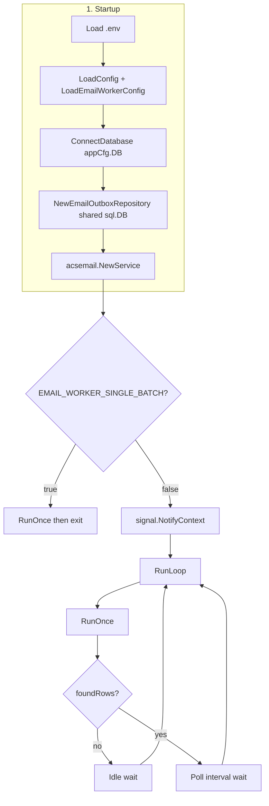
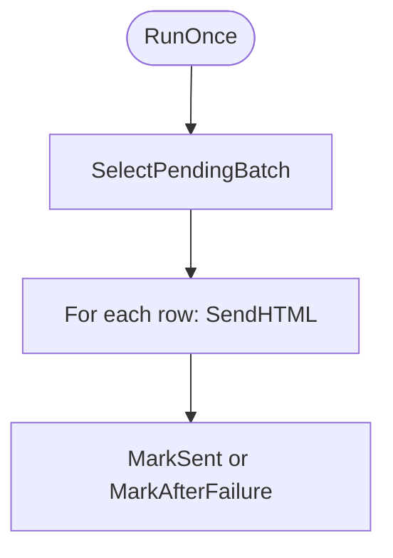
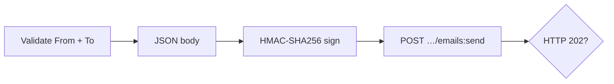

# Email worker (`cmd/email-worker`)

Background worker written in Go. It reads pending rows from **SQL Server** `MediAdmin.tbl_Emails` (without changing `IsSent` on pick), sends through **Azure Communication Services (ACS) Email** (REST + HMAC), then updates row state.

**Execution modes** (same idea as `cmd/fitness-worker`):

- **`EMAIL_WORKER_SINGLE_BATCH=false`** (default): **`RunLoop`** — polls with idle vs busy sleeps until **SIGINT** / **SIGTERM** (**Continuous** WebJob or local dev).
- **`EMAIL_WORKER_SINGLE_BATCH=true`**: **`RunOnce`** — processes one batch and exits (**Triggered** + **Scheduled** WebJob on App Service).

**Source layout** (mirrors `cmd/fitness-worker`: thin `main`, `internal/config`, `internal/worker/...`, `internal/repository`)

| Location | Role |
|----------|------|
| `src/cmd/email-worker/main.go` | `godotenv`, `LoadConfig` + `LoadEmailWorkerConfig`, `ConnectDatabase` (same DB env as API/fitness), logging, `RunOnce` vs `RunLoop` |
| `src/internal/config/email_worker.go` | `EmailWorkerConfig`, `LoadEmailWorkerConfig` — ACS + email tuning only (no separate DB connection string) |
| `src/internal/worker/email/run.go` | `Deps`, `RunLoop`, `RunOnce` |
| `src/internal/repository/email_outbox_repository.go` | `EmailOutboxRepository` on shared `*sql.DB` |
| `src/internal/acsemail/service.go` | ACS Email REST client |
| `src/internal/domain/email_outbox.go` | `OutboxEmail` |

> **Note:** The Go module `github.com/Azure/azure-sdk-for-go/sdk/communication/azemail` is not published on the public Go module proxy. This worker calls `POST …/emails:send` like the official SDKs.

---

## Behavior summary

1. Load environment and **`config.LoadConfig()`** for **`LOG_DIR`** / **`LOG_RETENTION_HOURS`** and shared **SQL** settings (**`DB_SERVER`**, **`DB_USER`**, **`DB_PASSWORD`**, **`DB_DATABASE_NAME`**, etc.) — **same as the fitness-worker**.
2. **`config.ConnectDatabase(appCfg.DB)`** opens the pool; **`EmailOutboxRepository`** uses that shared **`*sql.DB`**.
3. **`LoadEmailWorkerConfig()`** loads **ACS** and email-only options (`ACS_CONNECTION_STRING`, `EMAIL_*`, …).
4. If **`EMAIL_WORKER_SINGLE_BATCH`**: run **`RunOnce`** then exit. Else: **`RunLoop`** until shutdown.
5. Each batch: **`SelectPendingBatch`** → send each row → **`MarkSent`** or **`MarkAfterFailure`**.

The worker does **not** exit on a failed send for one row inside a batch; it logs, updates that row, and continues.

### Concurrency and duplicate sends

Because rows are **not** locked when read, **two instances can read the same pending rows**. **`MarkSent`** uses `WHERE … (IsSent = 0 OR IsSent IS NULL)` so only one sender wins. Prefer **one** scheduled WebJob or one continuous process unless you add coordination.

### From display name (e.g. UrMediConnect vs DoNotReply)

Set **`ACS_SENDER_DISPLAY_NAME=UrMediConnect`** so the worker includes **`senderDisplayName`** in the send request. If the inbox still shows **DoNotReply**, open your **Email Communication Service** (or ACS Email) in Azure Portal → **Domains** → your domain → **Mail From addresses** / sender usernames and set the **display name** there (or use Azure CLI to create/update a sender username with `--display-name`). Azure-managed domains often fix the label to **DoNotReply** until you use a **custom verified domain** with a configured sender display name.

---

## Environment variables

### Database (shared with API / fitness-worker — not email-specific)

Set the same variables you use for **`config.ConnectDatabase`**: at minimum **`DB_SERVER`**, **`DB_USER`**, **`DB_PASSWORD`**, **`DB_DATABASE_NAME`**. Optional: **`DB_POOL_MAX`**, **`DB_POOL_MIN`**, **`DB_ENCRYPT`**, **`DB_TRUST_SERVER_CERT`**, etc. See `internal/config/config.go` (`DBConfig`).

### Required (email / ACS)

| Variable | Description |
|----------|-------------|
| `ACS_CONNECTION_STRING` | ACS resource connection string; must include **`endpoint`** and **`accesskey`**. |

### Optional (email worker)

| Variable | Default | Description |
|----------|---------|-------------|
| `EMAIL_WORKER_SINGLE_BATCH` | `false` | `true` = one batch then exit (Scheduled WebJob). `false` = **`RunLoop`** (Continuous WebJob / dev). |
| `EMAIL_BATCH_SIZE` | `25` | Max rows per `SELECT TOP`. |
| `EMAIL_POLL_INTERVAL_SECONDS` | `120` | Used only in **`RunLoop`**: wait after a batch that had rows. |
| `EMAIL_IDLE_WAIT_SECONDS` | `60` | Used only in **`RunLoop`**: wait when no pending rows. |
| `EMAIL_SEND_TIMEOUT_SECONDS` | `60` | Per-email send timeout. HTTP client uses this + 5s. |
| `ACS_EMAIL_API_VERSION` | `2023-03-31` | REST `api-version` if empty default in code. |
| `ACS_SENDER_DISPLAY_NAME` | *(empty)* | From “friendly name” (e.g. `UrMediConnect`). Sent as `senderDisplayName` in the REST body. If mail still shows **DoNotReply**, set the display name on the **Mail From** address for your domain in **Azure Portal** (ACS Email → Domains) or Azure CLI — some tenants do not honor runtime display name. |

### Logging (from `LoadConfig`)

| Variable | Default | Description |
|----------|---------|---------|
| `LOG_DIR` | `logs` | Hourly log files. |
| `LOG_RETENTION_HOURS` | `24` | Retention for hourly writer. |

---

## Database: `MediAdmin.tbl_Emails`

| Column | Usage |
|--------|--------|
| `EmailID` | Primary key |
| `Subject`, `FromAddress`, `ToAddress`, `CCAddress`, `BCCAddress`, `BodyContent` | **HTML** from **`BodyContent`** → `content.html` |
| `IsSent` | Pending: `0` or `NULL`; success: `1` |
| `SentOn`, `CreatedOn`, `LastUpdatedOn` | Updated on **`MarkSent`** / **`MarkAfterFailure`**, not on read |

### Select pending batch (conceptual)

`SELECT TOP (N) … WHERE IsSent = 0 OR IsSent IS NULL ORDER BY CreatedOn, EmailID` with `ROWLOCK, READPAST` — **no update** on pick.

---

## Email sending (ACS)

- **Sender:** `FromAddress` must be allowed in ACS Email.
- **Recipients:** `ToAddress` (comma/semicolon); optional CC/BCC.
- **Success:** HTTP **202 Accepted**.

---

## Build and run

```bash
cd src
go build -o email-worker ./cmd/email-worker/
```

Example (same DB vars as fitness-worker; add ACS):

```bash
export DB_SERVER="yourserver.database.windows.net"
export DB_USER="..."
export DB_PASSWORD="..."
export DB_DATABASE_NAME="..."
export ACS_CONNECTION_STRING="endpoint=https://....communication.azure.com/;accesskey=..."
# Scheduled WebJob:
# export EMAIL_WORKER_SINGLE_BATCH=true
./email-worker
```

---

## Flow diagrams

### End-to-end overview



### One batch (`RunOnce`)

Same processing for both modes; **`RunLoop`** calls **`RunOnce`** repeatedly with sleeps between iterations.



### ACS send (`SendHTML` → REST)



---

## Related documentation

- **Staging — email-worker Linux WebJobs** (second WebJob on the same App Service): [STAGING-EMAIL_WORKER_LINUX_WEBJOBS_DEPLOYMENT.md](./STAGING-EMAIL_WORKER_LINUX_WEBJOBS_DEPLOYMENT.md)
- **PROD — email-worker Linux WebJobs:** [PROD-EMAIL_WORKER_LINUX_WEBJOBS_DEPLOYMENT.md](./PROD-EMAIL_WORKER_LINUX_WEBJOBS_DEPLOYMENT.md)
- **Staging — fitness-worker Linux WebJobs** (reference): [STAGING-FITNESS_WORKER_LINUX_WEBJOBS_DEPLOYMENT.md](./STAGING-FITNESS_WORKER_LINUX_WEBJOBS_DEPLOYMENT.md). For email, set **`EMAIL_WORKER_SINGLE_BATCH=true`** on a **Triggered** + **Scheduled** job (same idea as **`FITNESS_CERT_WORKER_RUN_ONCE=true`** for fitness).

---

## References

- [Send Email (REST) — Azure Communication](https://learn.microsoft.com/en-us/rest/api/communication/dataplane/email/send)
- [Authentication — Azure Communication Services](https://learn.microsoft.com/en-us/rest/api/communication/authentication)
