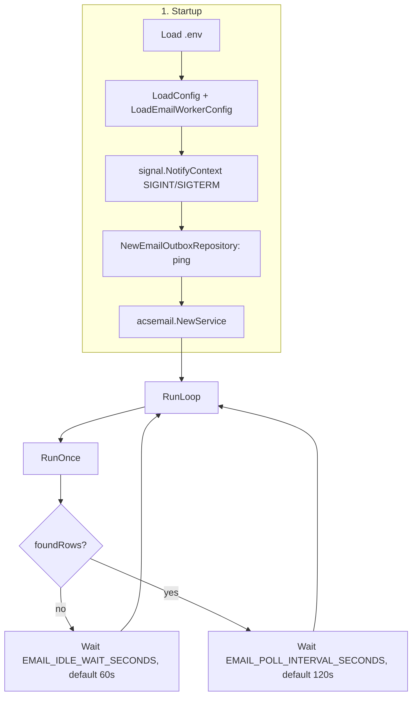
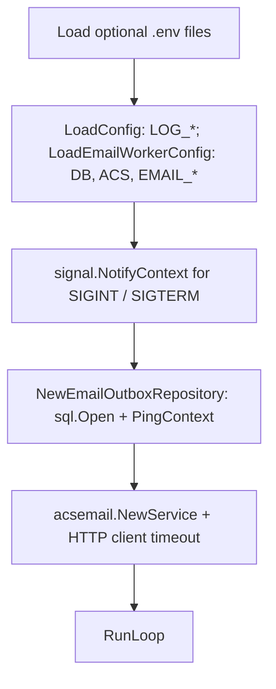
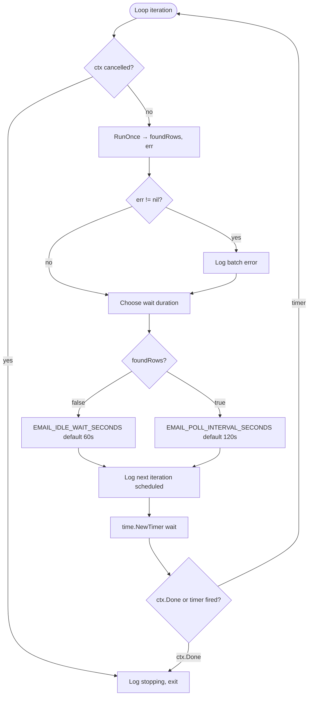
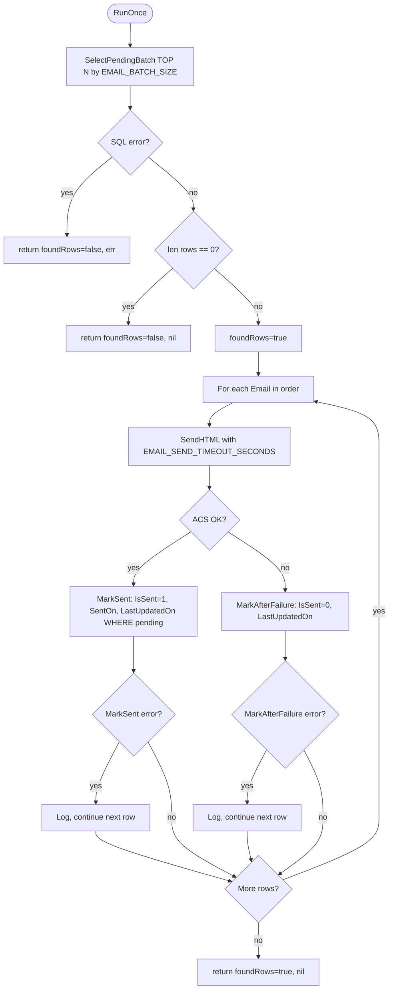
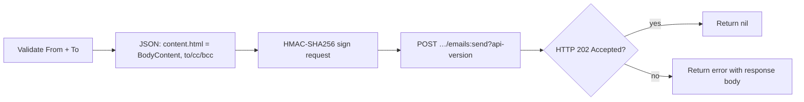

# Email worker (`cmd/email-worker`)

Background worker written in Go. It polls **SQL Server** for pending rows in `MediAdmin.tbl_Emails`, **reads** them in batches **without changing `IsSent` on pick**, sends messages through **Azure Communication Services (ACS) Email** using the **Email Data Plane REST API** (HMAC authentication), then updates row state on success or failure. The process loop runs until the process receives **SIGINT** or **SIGTERM**.

**Source layout** (same layering as `cmd/fitness-worker`: thin `main`, `internal/config`, `internal/worker/...`, `internal/repository`)

| Location | Role |
|----------|------|
| `src/cmd/email-worker/main.go` | `godotenv`, `config.LoadConfig` + `LoadEmailWorkerConfig`, hourly file logging (`internal/logging`), wire `Deps`, `signal.NotifyContext`, `emailworker.RunLoop` |
| `src/internal/config/email_worker.go` | `EmailWorkerConfig`, `LoadEmailWorkerConfig` (env: `DB_CONN_STRING`, `ACS_*`, `EMAIL_*`) |
| `src/internal/worker/email/run.go` | `Deps`, `RunLoop`, `RunOnce` — batch send loop and idle vs poll waits |
| `src/internal/repository/email_outbox_repository.go` | `EmailOutboxRepository`: `SelectPendingBatch` (read-only select), `MarkSent`, `MarkAfterFailure` |
| `src/internal/acsemail/service.go` | ACS Email REST client; HTML in `content.html` |
| `src/internal/domain/email_outbox.go` | `OutboxEmail` domain model for send payload |

> **Note:** The Go module `github.com/Azure/azure-sdk-for-go/sdk/communication/azemail` is not published on the public Go module proxy. This worker calls the same REST endpoint (`POST …/emails:send`) the official SDKs use.

---

## Behavior summary

1. Load environment (optional `.env` files) and shared app config via **`config.LoadConfig()`** (same as API / fitness-worker) for **`LOG_DIR`** / **`LOG_RETENTION_HOURS`** and hourly log files under prefix **`email-worker`**.
2. Open SQL Server and ping.
3. Parse **`ACS_CONNECTION_STRING`** (endpoint + access key) and build an HTTP client for sends.
4. Loop until shutdown:
   - **Select** up to `EMAIL_BATCH_SIZE` rows where **`IsSent = 0` or `IsSent IS NULL`**, ordered by **`CreatedOn`**, **`EmailID`**, using **`WITH (ROWLOCK, READPAST)`**. This step **does not** update `IsSent` or `LastUpdatedOn`.
   - For each row returned (in order): send via ACS, then **`IsSent = 1`** and **`SentOn`** on success (**only if the row is still pending** — see `MarkSent`), or **`IsSent = 0`** on failure via **`MarkAfterFailure`** (same pending state as inserts that use `0`; new rows may use **`NULL`** and are still selected).
   - **Sleep** before the next iteration: **`EMAIL_IDLE_WAIT_SECONDS`** (default **60s**) when **no rows** were returned, or **`EMAIL_POLL_INTERVAL_SECONDS`** (default **120s**) when **at least one row** was returned in the previous cycle. Exit immediately if the context is cancelled.

The worker does **not** exit on a failed send for one row; it logs, updates that row, and continues.

### Concurrency and duplicate sends

Because rows are **not** locked or marked “in progress” when read, **two worker instances can read the same pending rows** in the same window and both attempt to send. **`MarkSent`** updates with `WHERE EmailID = ? AND (IsSent = 0 OR IsSent IS NULL)`, so only the first successful completion wins; the other sees **no row updated** and logs an error. For predictable behavior with multiple replicas, run **one** worker process or add a different coordination strategy in code or infrastructure.

---

## Environment variables

### Required

| Variable | Description |
|----------|-------------|
| `DB_CONN_STRING` | SQL Server connection string (driver: `sqlserver` / `github.com/microsoft/go-mssqldb`). |
| `ACS_CONNECTION_STRING` | ACS resource connection string; must include **`endpoint`** and **`accesskey`**. |

### Optional

| Variable | Default | Description |
|----------|---------|-------------|
| `EMAIL_BATCH_SIZE` | `25` | Max rows **read** per iteration (`SELECT TOP`). |
| `EMAIL_POLL_INTERVAL_SECONDS` | `120` | Wait (**2 minutes**) before the next check **after** at least one row was **returned** in the previous cycle. |
| `EMAIL_IDLE_WAIT_SECONDS` | `60` | Wait (**1 minute**) when **no** pending rows were found (`IsSent` neither `0` nor `NULL`). |
| `EMAIL_SEND_TIMEOUT_SECONDS` | `60` | Per-email send timeout (`context.WithTimeout`). HTTP client timeout is this value plus 5 seconds. |
| `ACS_EMAIL_API_VERSION` | `2023-03-31` | Query parameter `api-version` for the Email REST API. |

---

## Database: `MediAdmin.tbl_Emails`

Expected columns (as used by the worker):

| Column | Usage |
|--------|--------|
| `EmailID` | Primary key |
| `Subject`, `FromAddress`, `ToAddress`, `CCAddress`, `BCCAddress`, `BodyContent` | Email content; **HTML** is taken from **`BodyContent`** and sent as `content.html` |
| `IsSent` | See state table below |
| `SentOn`, `CreatedOn`, `LastUpdatedOn` | Timestamps; **`LastUpdatedOn`** is set on **`MarkSent`** and **`MarkAfterFailure`**, not when rows are only read |

### `IsSent` values

| Value | Meaning |
|------|---------|
| `0` or `NULL` | Pending — eligible to be **selected** for sending |
| `1` | Sent successfully (`bit` **true** / `1` in SQL Server) |

The worker does **not** use an intermediate “processing” value (for example `-1`) when picking rows.

### Select pending batch (conceptual)

- **`SELECT TOP (N)`** of columns needed for send, from **`MediAdmin.tbl_Emails`**, **`WHERE IsSent = 0 OR IsSent IS NULL`**, **`ORDER BY CreatedOn ASC, EmailID ASC`**, with **`WITH (ROWLOCK, READPAST)`** to skip locked rows when scanning.
- **No `UPDATE`** in this step — rows stay pending until **`MarkSent`** or **`MarkAfterFailure`**.

---

## Email sending (ACS)

- **Sender:** `FromAddress` from the database (must match a verified domain/sender in ACS).
- **Recipients:** `ToAddress` required; addresses may be separated by **comma or semicolon**. `CCAddress` and `BCCAddress` are optional; same splitting rules.
- **Body:** HTML only in the REST payload: `content.html` = `BodyContent`.
- **Success:** HTTP **202 Accepted** from ACS.

---

## Build and run

From the `src` module root:

```bash
cd src
go build -o email-worker ./cmd/email-worker/
```

Run (set variables in the shell or `.env`):

```bash
export DB_CONN_STRING="sqlserver://..."
export ACS_CONNECTION_STRING="endpoint=https://....communication.azure.com/;accesskey=..."
./email-worker
```

Stop with **Ctrl+C** (SIGINT) or send **SIGTERM**; the worker stops after the current batch step and/or cancels the poll sleep.

---

## Flow diagrams

The diagrams below mirror `internal/worker/email/run.go` (`RunLoop`, `RunOnce`), `internal/repository/email_outbox_repository.go`, and `internal/acsemail/service.go`. Defaults: **60s** idle wait when the queue is empty, **120s** wait after a non-empty read.

### End-to-end overview



### Startup (sequence)



### Main loop (`RunLoop`)

Each iteration: run **`RunOnce`** → compute **wait** → **timer** (honours shutdown during sleep).



**Note:** If **`RunOnce`** fails (for example SQL error), `foundRows` is **false**, so the next wait uses the **idle** duration unless you change the code.

### One iteration (`RunOnce`)

Pending rows are **read** with **`IsSent = 0 OR IsSent IS NULL`**; **`MarkSent`** requires the row to **still** be pending.



### ACS send (`SendHTML` → REST)



---

## Related documentation

- For **Linux App Service WebJobs** packaging patterns (binary + `run.sh`, schedules), see [STAGING-FITNESS_WORKER_LINUX_WEBJOBS_DEPLOYMENT.md](./STAGING-FITNESS_WORKER_LINUX_WEBJOBS_DEPLOYMENT.md). This email worker runs as a **long-running** process by default; adapt scheduling only if you wrap it differently (e.g. single-shot mode would require a code change).

---

## References

- [Send Email (REST) — Azure Communication](https://learn.microsoft.com/en-us/rest/api/communication/dataplane/email/send)
- [Authentication — Azure Communication Services](https://learn.microsoft.com/en-us/rest/api/communication/authentication)
