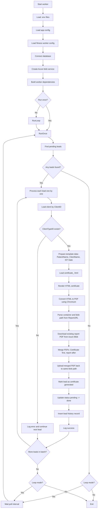

# Fitness Worker Flow

This document explains the current implementation of the fitness worker found at `src/cmd/fitness-worker/main.go` and the internal code it calls.

## Purpose

The current worker is a background process for **fitness certificate generation and merge**.

It does not consume messages from a queue. Instead, it:

1. Polls the database for leads that are ready for fitness certificate generation.
2. Generates a certificate PDF from an HTML template.
3. Downloads the already uploaded diagnostic report PDF from Azure Blob Storage.
4. Merges the fitness certificate PDF as the first page.
5. Uploads the merged PDF back to the same Azure blob path.
6. Updates the lead status and audit/history fields in the database.

## Entry Point

The worker starts from:

- `src/cmd/fitness-worker/main.go`

## Startup Flow

At startup, the worker performs the following steps:

1. Loads environment variables from multiple common `.env` locations.
2. Loads the general application config using `config.LoadConfig()`.
3. Loads worker-specific config using `config.LoadFitnessCertWorkerConfig()`.
4. Connects to the database using `config.ConnectDatabase(appCfg.DB)`.
5. Creates the Azure blob service using `storage.NewAzureMoUBlobService(...)`.
6. Builds the worker dependencies object `fitness.Deps`.
7. Creates a cancellation-aware context that listens for `SIGINT` and `SIGTERM`.
8. Decides whether to:
   - run only once using `fitness.RunOnce(...)`, or
   - keep polling using `fitness.RunLoop(...)`.

## Dependencies Wired Into The Worker

The worker currently builds these dependencies:

- `DB`
- `Blob`
- `LeadRepo`
- `ClientRepo`
- `Config`
- `Log`

These are passed through the `fitness.Deps` struct in `src/internal/worker/fitness/run.go`.

## Worker Configuration

Worker configuration is loaded from `src/internal/config/fitness_worker.go`.

### Supported Environment Variables

- `FITNESS_CERT_TEMPLATE_DIR`
  - Directory that contains files like `certificate_<ClientTypeID>.html`
- `FITNESS_CERT_PENDING_LEAD_STATUS_ID`
  - Default: `9`
- `FITNESS_CERT_DONE_LEAD_STATUS_ID`
  - Default: `10`
- `FITNESS_CERT_POLL_INTERVAL_SECONDS`
  - Default: `300`
- `FITNESS_CERT_BATCH_SIZE`
  - Default: `10`
- `CHROMIUM_PATH`
  - Optional path to Chromium/Chrome binary
- `FITNESS_CERT_WORKER_RUN_ONCE`
  - If `true`, process one batch and exit
- `FITNESS_CERT_WORKER_USER_ID`
  - Required positive integer used for audit columns and lead history

### Important Validation

`FITNESS_CERT_WORKER_USER_ID` is required. If it is missing or invalid, the worker fails on startup.

## Operating Modes

The worker supports two modes:

### 1. Run Once

If `FITNESS_CERT_WORKER_RUN_ONCE=true`, the worker:

- runs a single batch,
- processes up to `BatchSize` eligible leads,
- exits afterward.

This is suitable for cron or one-shot execution.

### 2. Run Loop

If `FITNESS_CERT_WORKER_RUN_ONCE=false`, the worker:

- runs a batch,
- waits for `PollInterval`,
- repeats until the process is stopped.

This is suitable for long-running background service mode.

## Current End-To-End Flow Diagram

## Batch Processing Flow

The batch logic lives in `src/internal/worker/fitness/run.go`.

### `RunLoop(...)`

`RunLoop(...)` does the following:

1. Calls `RunOnce(...)`.
2. Logs the batch error if one occurs.
3. Waits for `Config.PollInterval`.
4. Repeats until the context is cancelled.

Important characteristics:

- There is no queue consumer.
- There is no scheduler beyond a simple sleep-based polling loop.
- There is no internal worker pool or concurrency control.

### `RunOnce(...)`

`RunOnce(...)` does the following:

1. Fetches up to `BatchSize` pending leads using `LeadRepo.FindLeadsPendingFitCertification(...)`.
2. Iterates through the leads one by one.
3. Calls `processLead(...)` for each lead.
4. Logs lead-level failures and continues processing the remaining leads.

Important characteristics:

- Processing is sequential.
- A single lead failure does not stop the entire batch.
- The batch is best effort, not transactional across all leads.

## Which Leads Are Currently Eligible

Lead selection happens in `src/internal/repository/lead_repository.go` inside:

- `FindLeadsPendingFitCertification(limit, pendingLeadStatusID)`

The query currently selects leads where:

- `LeadStatusID = pendingLeadStatusID`
- `IsFit = true`
- `IsFitCertifiedGenerated = false`
- `ReportURL IS NOT NULL`
- `ReportURL` is not blank after trimming

The results are ordered by:

- `LeadID ASC`

And limited by:

- `limit` which usually maps to `FITNESS_CERT_BATCH_SIZE`

### Meaning Of Current Eligibility

Only leads that already satisfy all of the following are processed:

- already marked as fit,
- already have a report PDF URL stored,
- have not yet been marked as certificate-generated,
- are still in the configured pending lead status.

## Per-Lead Processing Flow

Per-lead processing happens in `processLead(...)` inside `src/internal/worker/fitness/run.go`.

### Step 1. Load Client

The worker fetches the client record by:

- `lead.ClientID`

using:

- `ClientRepo.FindByID(...)`

If the client cannot be loaded, that lead fails.

### Step 2. Validate Client Type

The worker requires:

- `client.ClientTypeID`

If `ClientTypeID` is `nil`, the lead fails with an error because the template name depends on the client type.

### Step 3. Build Template Data

The worker builds template input using:

- `Name = lead.PatientName`
- `Company = client.ClientName`
- `Date = current date in IST formatted as 02-Jan-2006`

### Step 4. Render HTML Template

The worker calls:

- `fitnesscert.RenderCertificateHTML(...)`

This function:

1. Builds a file name like `certificate_<ClientTypeID>.html`
2. Loads the template from `TemplateDir`
3. Parses it using Go `text/template`
4. Executes the template with the prepared data

Example template naming pattern:

- `certificate_1.html`
- `certificate_2.html`

This means the current design is:

- one certificate template per client type

### Step 5. Convert HTML To PDF

The worker then calls:

- `fitnesscert.HTMLToPDF(...)`

This function:

1. Writes the rendered HTML to a temporary file.
2. Converts the temp file path into a `file://` URL.
3. Starts headless Chromium through `chromedp`.
4. Opens the HTML file.
5. Prints it to PDF with configured page size and margins.
6. Returns the PDF bytes in memory.

Important details:

- Chromium must be available either in `PATH` or via `CHROMIUM_PATH`.
- The operation uses a timeout of 2 minutes.
- The PDF is generated in memory after rendering.

### Step 6. Parse The Report Blob Location

The worker reads `lead.ReportURL` and calls:

- `storage.ParseAzureBlobContainerAndBlob(...)`

This extracts:

- the Azure blob container name,
- the blob path/name inside that container.

The function expects:

- an `https` Azure Blob URL,
- a valid container segment,
- a valid blob path.

If parsing fails, the lead fails.

### Step 7. Download Existing Report PDF

The worker calls:

- `Blob.DownloadBlob(ctx, container, blobName)`

This downloads the full report PDF into memory from Azure Blob Storage.

Important detail:

- the worker assumes the existing diagnostic report is already present and valid.

### Step 8. Merge PDFs

The worker calls:

- `fitnesscert.MergeCertificateFirst(certPDF, reportPDF)`

This uses `pdfcpu` to merge the PDFs in this order:

1. fitness certificate PDF first
2. original report PDF after it

So the resulting uploaded file starts with the generated certificate as page 1.

### Step 9. Upload The Merged PDF

The worker calls:

- `Blob.UploadDiagnosticReportPDFBytes(ctx, container, blobName, merged)`

This overwrites the existing report blob at the exact same Azure location.

Important behavior:

- it does not create a new output file,
- it does not create a side-by-side certificate file,
- it replaces the original report blob content with the merged PDF.

### Step 10. Mark Lead As Completed

After the upload succeeds, the worker calls:

- `LeadRepo.MarkFitCertificationGenerated(...)`

This performs a database transaction that:

1. Re-checks that the lead still matches the expected pending criteria.
2. Updates the lead row.
3. Inserts a lead-history record.

#### Lead Row Changes

If the row still matches the expected state, the worker updates:

- `IsFitCertifiedGenerated = true`
- `FitCertifiedGeneratedOn = now`
- `LeadStatusID = done status`
- `LastUpdatedBy = FITNESS_CERT_WORKER_USER_ID`
- `LastUpdatedOn = now`

#### Lead History Changes

It also inserts a lead history row with:

- `LeadID`
- `Action = LeadActionFitCertificationGenerated`
- `CreatedBy = FITNESS_CERT_WORKER_USER_ID`
- `CreatedOn = now`

### Step 11. Log Result

If the lead completes successfully, the worker logs success.

If the DB row no longer matches the expected pending criteria when the final update runs:

- no update is applied,
- a warning is logged,
- but the blob may already have been overwritten.

## Azure Blob Behavior In The Current Design

The worker uses `AzureMoUBlobService`, but this service also handles diagnostic reports.

Relevant blob operations used by the worker:

- `ParseAzureBlobContainerAndBlob(...)`
- `DownloadBlob(...)`
- `UploadDiagnosticReportPDFBytes(...)`

### Current Blob Strategy

The current blob strategy is:

1. Read the blob location from `tbl_Leads.ReportURL`
2. Download that blob
3. Merge generated certificate + existing report
4. Upload back to the same container and blob name

This means:

- the original stored report content is replaced,
- the stored `ReportURL` does not change,
- the merged file becomes the new report at the same URL.

## Error Handling Behavior

### Startup Errors

The process exits immediately on:

- invalid worker config,
- database connection failure,
- Azure blob client creation failure.

### Batch Errors

Inside `RunLoop(...)`:

- batch-level errors are logged,
- the worker continues looping on the next poll interval.

### Lead-Level Errors

Inside `RunOnce(...)`:

- individual lead failures are logged,
- processing continues with the next lead.

### No Global Transaction

There is no single transaction covering:

- PDF generation,
- blob download,
- PDF merge,
- blob upload,
- DB update.

So external side effects can happen before the final database update.

## What Is Currently Implemented

The current implementation already supports:

- environment-driven configuration,
- one-shot and polling execution modes,
- pending lead lookup from DB,
- per-client-type HTML certificate templates,
- HTML to PDF generation using Chromium,
- PDF merge with certificate as the first page,
- Azure Blob download and overwrite,
- lead status transition after success,
- audit fields and lead-history insertion,
- graceful stop on `SIGINT` and `SIGTERM`.

## What Is Not Currently Implemented

The current implementation does not yet include:

- queue-based or event-driven processing,
- parallel lead processing,
- explicit retry tracking in the database,
- dead-letter handling for failed leads,
- separate storage of original report vs merged report,
- idempotency protection before overwrite,
- rollback behavior if blob upload succeeds but DB update later does not,
- startup-time validation of all certificate templates,
- richer failure categorization or recovery workflow,
- per-lead persistent processing state,
- dashboarding or job metrics.

## Practical Summary

The current fitness worker is a **database-polling batch processor**.

Its current business flow is:

1. Find leads that are fit, pending, and still missing a generated certificate.
2. Resolve the client and choose the correct template using `ClientTypeID`.
3. Render the certificate HTML.
4. Convert the certificate HTML into PDF.
5. Download the previously uploaded report PDF from Azure Blob.
6. Merge the generated certificate before the report.
7. Overwrite the original report blob with the merged PDF.
8. Mark the lead as certificate-generated and move it to the done status.
9. Write lead-history audit data.

## Suggested Next Discussion Areas

Possible next topics for improving this worker:

1. Queue-based processing instead of polling
2. Retry and failure recovery strategy
3. Keeping original report and merged report as separate files
4. Making the flow idempotent and concurrency-safe
5. Template management and validation
6. Observability, metrics, and operational controls
